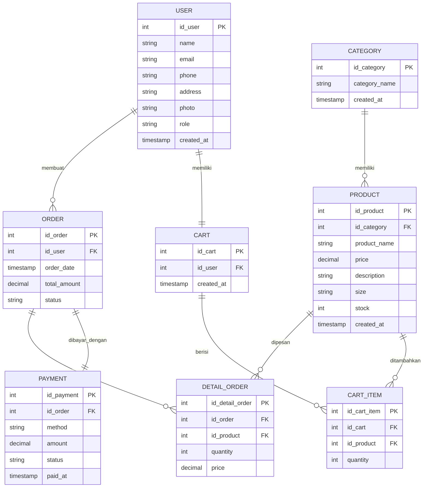

```mermaid
erDiagram

    USER ||--o{ ORDER : membuat
    USER ||--|| CART : memiliki
    USER {
        int id_user PK
        string name
        string email
        string phone
        string address
        string photo
        string role
        timestamp created_at
    }

    CATEGORY ||--o{ PRODUCT : memiliki
    CATEGORY {
        int id_category PK
        string category_name
        timestamp created_at
    }

    PRODUCT ||--o{ DETAIL_ORDER : dipesan
    PRODUCT ||--o{ CART_ITEM : ditambahkan
    PRODUCT {
        int id_product PK
        int id_category FK
        string product_name
        decimal price
        string description
        string size
        int stock
        timestamp created_at
    }

    CART ||--o{ CART_ITEM : berisi
    CART {
        int id_cart PK
        int id_user FK
        timestamp created_at
    }

    CART_ITEM {
        int id_cart_item PK
        int id_cart FK
        int id_product FK
        int quantity
    }

    ORDER ||--o{ DETAIL_ORDER : memiliki
    ORDER ||--|| PAYMENT : dibayar_dengan
    ORDER {
        int id_order PK
        int id_user FK
        timestamp order_date
        decimal total_amount
        string status
    }

    DETAIL_ORDER {
        int id_detail_order PK
        int id_order FK
        int id_product FK
        int quantity
        decimal price
    }

    PAYMENT {
        int id_payment PK
        int id_order FK
        string method
        decimal amount
        string status
        timestamp paid_at
    }
```